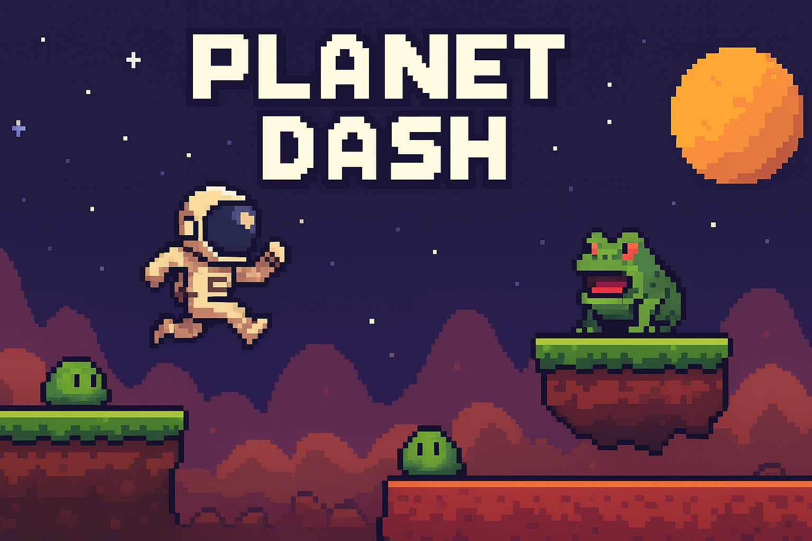

**Planet Dash** é um jogo de plataforma desenvolvido em **Pygame Zero**, onde você controla um astronauta que precisa superar obstáculos e enfrentar inimigos para chegar ao final da fase.

## 🕹️ Como Jogar
- Use as setas do teclado para se mover.
- Pressione a tecla de pulo para saltar sobre blocos e inimigos.
- Evite tocar nos inimigos (sapos e slimes) para não perder pontos ou vida.
- Alcance a saída para completar a fase.

## 🎮 Capa do Jogo


Foi utilizado:

- Python 3.x
- Pygame Zero

## ⚙️ Tecnologias Utilizadas
- **Python 3.x**
- **Pygame Zero**

## 🚀 Como Executar
1. Clone o repositório:
```
git clone https://github.com/seu-usuario/PlanetDash.git
cd PlanetDash
pgzrun planetdash.py
```
✨ Recursos do Jogo

- Jogabilidade simples e divertida

- Inimigos com diferentes comportamentos

- Obstáculos e plataformas variadas

- Cenários coloridos e animados

